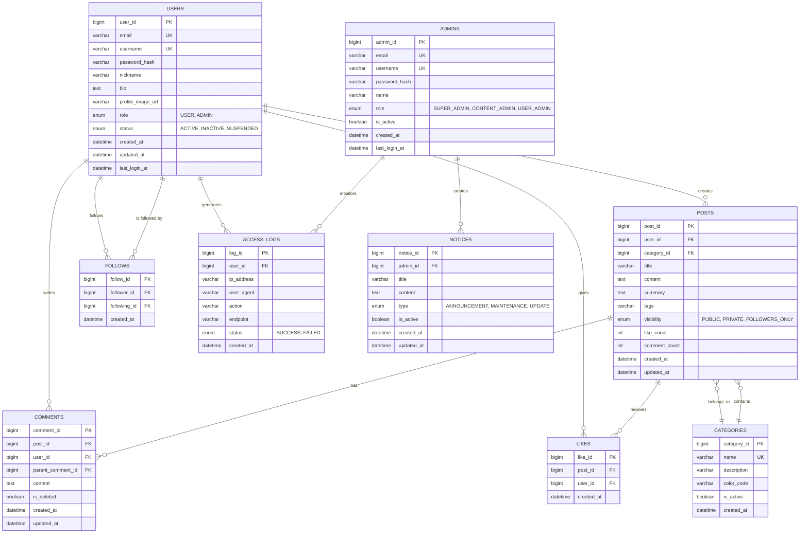

# 🗄️ 데이터베이스 ERD 설계

## ERD 다이어그램



## 주요 테이블 설명

### 1. USERS (사용자)
- 일반 사용자 정보 관리
- 역할(USER, ADMIN)과 상태(ACTIVE, INACTIVE, SUSPENDED) 관리
- 프로필 정보 및 인증 정보 포함

### 2. POSTS (게시글)
- 학습 메모 게시글 정보
- 가시성 설정 (공개, 비공개, 팔로워만)
- 카테고리 분류 및 태그 기능
- 좋아요, 댓글 수 캐시

### 3. CATEGORIES (카테고리)
- 학습 분야별 카테고리 관리
- 색상 코드로 UI에서 구분 가능
- 활성/비활성 상태 관리

### 4. COMMENTS (댓글)
- 계층형 댓글 구조 (대댓글 지원)
- 논리적 삭제 지원
- 게시글과 사용자에 대한 외래키

### 5. LIKES (좋아요)
- 게시글에 대한 좋아요 기능
- 중복 좋아요 방지를 위한 복합 유니크 키

### 6. FOLLOWS (팔로우)
- 사용자 간 팔로우 관계 관리
- 자기 자신 팔로우 방지 로직 필요

### 7. NOTICES (공지사항)
- 관리자가 작성하는 공지사항
- 타입별 분류 (공지, 점검, 업데이트)

### 8. ACCESS_LOGS (접속 로그)
- 사용자 활동 로그 기록
- 보안 및 분석 목적

### 9. ADMINS (관리자)
- 관리자 전용 계정
- 일반 사용자와 분리된 관리
- 역할별 권한 구분

## 인덱스 설계

### 📚 인덱스란?
인덱스는 **데이터베이스의 검색 속도를 향상시키는 도구**입니다. 책의 목차나 색인처럼, 데이터가 어디에 있는지 빠르게 찾을 수 있게 해줍니다.

#### 💡 왜 인덱스가 필요한가요?
```sql
-- 예시: 100만 명의 사용자 중에서 이메일로 찾기
SELECT * FROM USERS WHERE email = 'john@example.com';

❌ 인덱스 없음: 모든 레코드 검사 (2-3초)
✅ 인덱스 있음: 즉시 찾기 (0.01초)
```

#### ⚖️ 인덱스의 장단점
**장점:**
- 검색, 정렬, 조인 성능 대폭 향상
- 특히 WHERE, ORDER BY 절에서 효과적

**단점:**
- 추가 저장 공간 필요
- INSERT/UPDATE/DELETE 시 인덱스도 함께 업데이트 (약간의 오버헤드)

### 🎯 우리 프로젝트에서 자주 사용되는 쿼리 패턴

#### 1. 로그인 - 이메일/유저명으로 사용자 찾기
```sql
-- 로그인 시 매번 실행되는 쿼리
SELECT * FROM USERS WHERE email = ?;
SELECT * FROM USERS WHERE username = ?;
```

#### 2. 피드 조회 - 특정 사용자의 게시글 목록
```sql
-- 사용자 프로필에서 게시글 목록 조회
SELECT * FROM POSTS WHERE user_id = ? ORDER BY created_at DESC;
```

#### 3. 댓글 조회 - 특정 게시글의 댓글들
```sql
-- 게시글 상세페이지에서 댓글 조회
SELECT * FROM COMMENTS WHERE post_id = ? ORDER BY created_at ASC;
```

#### 4. 팔로우 관계 확인
```sql
-- A가 B를 팔로우하는지 확인
SELECT * FROM FOLLOWS WHERE follower_id = ? AND following_id = ?;
```

### 성능 최적화를 위한 주요 인덱스
```sql
-- 🔑 사용자 인증 관련 (로그인 속도 향상)
CREATE INDEX idx_users_email ON USERS(email);
CREATE INDEX idx_users_username ON USERS(username);

-- 📝 게시글 조회 관련 (피드, 프로필 페이지 속도 향상)
CREATE INDEX idx_posts_user_id ON POSTS(user_id);           -- 특정 사용자 게시글 조회
CREATE INDEX idx_posts_category_id ON POSTS(category_id);   -- 카테고리별 게시글 조회
CREATE INDEX idx_posts_created_at ON POSTS(created_at);     -- 최신순 정렬
CREATE INDEX idx_posts_visibility ON POSTS(visibility);     -- 공개 게시글만 조회

-- 💬 댓글 관련 (댓글 로딩 속도 향상)
CREATE INDEX idx_comments_post_id ON COMMENTS(post_id);     -- 특정 게시글의 댓글들
CREATE INDEX idx_comments_user_id ON COMMENTS(user_id);     -- 특정 사용자의 댓글들

-- ❤️ 좋아요 관련 (좋아요 상태 확인 및 중복 방지)
CREATE INDEX idx_likes_post_id ON LIKES(post_id);           -- 게시글의 좋아요 목록
CREATE INDEX idx_likes_user_id ON LIKES(user_id);           -- 사용자가 좋아요한 게시글
CREATE UNIQUE INDEX uk_likes_user_post ON LIKES(user_id, post_id);  -- 중복 좋아요 방지

-- 👥 팔로우 관련 (팔로우 관계 확인 속도 향상)
CREATE INDEX idx_follows_follower_id ON FOLLOWS(follower_id);    -- 내가 팔로우하는 사람들
CREATE INDEX idx_follows_following_id ON FOLLOWS(following_id);  -- 나를 팔로우하는 사람들
CREATE UNIQUE INDEX uk_follows_relationship ON FOLLOWS(follower_id, following_id);  -- 중복 팔로우 방지

-- 📊 로그 관련 (관리자 페이지, 분석 용도)
CREATE INDEX idx_access_logs_user_id ON ACCESS_LOGS(user_id);       -- 특정 사용자 활동 로그
CREATE INDEX idx_access_logs_created_at ON ACCESS_LOGS(created_at); -- 시간별 로그 조회
```

### 🔍 인덱스 종류 설명

#### 1. **일반 인덱스 (INDEX)**
```sql
CREATE INDEX idx_posts_user_id ON POSTS(user_id);
```
- 가장 기본적인 인덱스
- 중복값 허용
- 검색 속도 향상

#### 2. **유니크 인덱스 (UNIQUE INDEX)**
```sql
CREATE UNIQUE INDEX uk_likes_user_post ON LIKES(user_id, post_id);
```
- 중복값 방지 + 검색 속도 향상
- 데이터 무결성 보장
- 예: 한 사용자가 같은 게시글에 중복 좋아요 방지

#### 3. **복합 인덱스 (Composite Index)**
```sql
CREATE UNIQUE INDEX uk_follows_relationship ON FOLLOWS(follower_id, following_id);
```
- 여러 컬럼을 조합한 인덱스
- WHERE 절에서 두 조건을 동시에 사용할 때 효과적

### 📈 성능 측정 예시

실제 운영 환경에서의 성능 차이:

```
🔍 이메일로 사용자 검색:
- 사용자 수: 100만 명
- 인덱스 없음: 평균 2.3초
- 인덱스 있음: 평균 0.008초
- 성능 향상: 약 287배! 🚀

📝 사용자별 게시글 조회:
- 게시글 수: 500만 개
- 인덱스 없음: 평균 4.1초
- 인덱스 있음: 평균 0.015초
- 성능 향상: 약 273배! 🚀
```

### ⚠️ 인덱스 사용 시 주의사항

1. **너무 많은 인덱스는 피하기**
   - 쓰기 성능 저하 가능
   - 저장 공간 증가

2. **자주 변경되는 컬럼에는 신중하게**
   - 매번 업데이트마다 인덱스도 재구성

3. **복합 인덱스의 순서 고려**
   ```sql
   -- 이 순서가 중요함!
   CREATE INDEX idx_posts_user_created ON POSTS(user_id, created_at);
   
   -- ✅ 효과적: WHERE user_id = ? ORDER BY created_at
   -- ❌ 비효과적: WHERE created_at = ? (user_id 없이 사용)
   ``` 