# 🗄️ Oracle Database ERD 설계

## ERD 다이어그램

```mermaid
erDiagram
    USERS ||--o{ POSTS : creates
    USERS ||--o{ COMMENTS : writes
    USERS ||--o{ LIKES : gives
    USERS ||--o{ BOOKMARKS : saves
    USERS ||--o{ BOOKMARK_FOLDERS : creates
    USERS ||--o{ FOLLOWS : follows
    USERS ||--o{ FOLLOWS : "is followed by"
    USERS ||--o{ ACCESS_LOGS : generates
    
    POSTS ||--o{ COMMENTS : has
    POSTS ||--o{ LIKES : receives
    POSTS ||--o{ BOOKMARKS : "is saved by"
    POSTS }o--|| CATEGORIES : belongs_to
    
    BOOKMARK_FOLDERS ||--o{ BOOKMARKS : contains
    BOOKMARK_FOLDERS ||--o{ BOOKMARK_FOLDERS : "has subfolders"
    
    CATEGORIES ||--o{ POSTS : contains
    
    ADMINS ||--o{ NOTICES : creates
    ADMINS ||--o{ ACCESS_LOGS : monitors
    
    USERS {
        number user_id PK "NUMBER(19)"
        varchar2 email UK "VARCHAR2(255)"
        varchar2 username UK "VARCHAR2(100)"
        varchar2 password_hash "VARCHAR2(255)"
        varchar2 nickname "VARCHAR2(100)"
        clob bio "CLOB"
        varchar2 profile_image_url "VARCHAR2(500)"
        varchar2 role "VARCHAR2(20) CHECK(role IN 'USER, ADMIN')"
        varchar2 status "VARCHAR2(20) CHECK(status IN 'ACTIVE, INACTIVE, SUSPENDED')"
        timestamp created_at "TIMESTAMP DEFAULT CURRENT_TIMESTAMP"
        timestamp updated_at "TIMESTAMP DEFAULT CURRENT_TIMESTAMP"
        timestamp last_login_at "TIMESTAMP"
    }
    
    POSTS {
        number post_id PK "NUMBER(19)"
        number user_id FK "NUMBER(19)"
        number category_id FK "NUMBER(19)"
        varchar2 title "VARCHAR2(500)"
        clob content "CLOB"
        clob summary "CLOB"
        varchar2 tags "VARCHAR2(1000)"
        varchar2 visibility "VARCHAR2(20) CHECK(visibility IN 'PUBLIC, PRIVATE, FOLLOWERS_ONLY')"
        number like_count "NUMBER(10) DEFAULT 0"
        number comment_count "NUMBER(10) DEFAULT 0"
        timestamp created_at "TIMESTAMP DEFAULT CURRENT_TIMESTAMP"
        timestamp updated_at "TIMESTAMP DEFAULT CURRENT_TIMESTAMP"
    }
    
    CATEGORIES {
        number category_id PK "NUMBER(19)"
        varchar2 name UK "VARCHAR2(100)"
        varchar2 description "VARCHAR2(500)"
        varchar2 color_code "VARCHAR2(7)"
        number is_active "NUMBER(1) CHECK(is_active IN (0,1)) DEFAULT 1"
        timestamp created_at "TIMESTAMP DEFAULT CURRENT_TIMESTAMP"
    }
    
    COMMENTS {
        number comment_id PK "NUMBER(19)"
        number post_id FK "NUMBER(19)"
        number user_id FK "NUMBER(19)"
        number parent_comment_id FK "NUMBER(19)"
        clob content "CLOB"
        number is_deleted "NUMBER(1) CHECK(is_deleted IN (0,1)) DEFAULT 0"
        timestamp created_at "TIMESTAMP DEFAULT CURRENT_TIMESTAMP"
        timestamp updated_at "TIMESTAMP DEFAULT CURRENT_TIMESTAMP"
    }
    
    LIKES {
        number like_id PK "NUMBER(19)"
        number post_id FK "NUMBER(19)"
        number user_id FK "NUMBER(19)"
        timestamp created_at "TIMESTAMP DEFAULT CURRENT_TIMESTAMP"
    }
    
    BOOKMARKS {
        number bookmark_id PK "NUMBER(19)"
        number user_id FK "NUMBER(19)"
        number post_id FK "NUMBER(19)"
        number folder_id FK "NUMBER(19)"
        clob notes "CLOB"
        varchar2 visibility "VARCHAR2(20) CHECK(visibility IN 'PUBLIC, PRIVATE') DEFAULT 'PRIVATE'"
        timestamp created_at "TIMESTAMP DEFAULT CURRENT_TIMESTAMP"
        timestamp updated_at "TIMESTAMP DEFAULT CURRENT_TIMESTAMP"
    }
    
    BOOKMARK_FOLDERS {
        number folder_id PK "NUMBER(19)"
        number user_id FK "NUMBER(19)"
        number parent_folder_id FK "NUMBER(19)"
        varchar2 name "VARCHAR2(100)"
        varchar2 description "VARCHAR2(500)"
        varchar2 color_code "VARCHAR2(7)"
        varchar2 icon "VARCHAR2(50)"
        varchar2 visibility "VARCHAR2(20) CHECK(visibility IN 'PUBLIC, PRIVATE') DEFAULT 'PRIVATE'"
        number sort_order "NUMBER(10) DEFAULT 0"
        timestamp created_at "TIMESTAMP DEFAULT CURRENT_TIMESTAMP"
        timestamp updated_at "TIMESTAMP DEFAULT CURRENT_TIMESTAMP"
    }
    
    FOLLOWS {
        number follow_id PK "NUMBER(19)"
        number follower_id FK "NUMBER(19)"
        number following_id FK "NUMBER(19)"
        timestamp created_at "TIMESTAMP DEFAULT CURRENT_TIMESTAMP"
    }
    
    NOTICES {
        number notice_id PK "NUMBER(19)"
        number admin_id FK "NUMBER(19)"
        varchar2 title "VARCHAR2(500)"
        clob content "CLOB"
        varchar2 type "VARCHAR2(20) CHECK(type IN 'ANNOUNCEMENT, MAINTENANCE, UPDATE')"
        number is_active "NUMBER(1) CHECK(is_active IN (0,1)) DEFAULT 1"
        timestamp created_at "TIMESTAMP DEFAULT CURRENT_TIMESTAMP"
        timestamp updated_at "TIMESTAMP DEFAULT CURRENT_TIMESTAMP"
    }
    
    ACCESS_LOGS {
        number log_id PK "NUMBER(19)"
        number user_id FK "NUMBER(19)"
        varchar2 ip_address "VARCHAR2(45)"
        varchar2 user_agent "VARCHAR2(1000)"
        varchar2 action "VARCHAR2(100)"
        varchar2 endpoint "VARCHAR2(500)"
        varchar2 status "VARCHAR2(20) CHECK(status IN 'SUCCESS, FAILED')"
        timestamp created_at "TIMESTAMP DEFAULT CURRENT_TIMESTAMP"
    }
    
    ADMINS {
        number admin_id PK "NUMBER(19)"
        varchar2 email UK "VARCHAR2(255)"
        varchar2 username UK "VARCHAR2(100)"
        varchar2 password_hash "VARCHAR2(255)"
        varchar2 name "VARCHAR2(100)"
        varchar2 role "VARCHAR2(30) CHECK(role IN 'SUPER_ADMIN, CONTENT_ADMIN, USER_ADMIN')"
        number is_active "NUMBER(1) CHECK(is_active IN (0,1)) DEFAULT 1"
        timestamp created_at "TIMESTAMP DEFAULT CURRENT_TIMESTAMP"
        timestamp last_login_at "TIMESTAMP"
    }
```



## Oracle 데이터 타입 특징

### 📊 MariaDB → Oracle 변환 규칙

| MariaDB | Oracle | 설명 |
|---------|--------|------|
| `BIGINT` | `NUMBER(19)` | 19자리 정수 |
| `VARCHAR(n)` | `VARCHAR2(n)` | 가변 길이 문자열 |
| `TEXT` | `CLOB` | 대용량 텍스트 |
| `DATETIME` | `TIMESTAMP` | 날짜/시간 |
| `BOOLEAN` | `NUMBER(1)` | 0/1로 불린값 표현 |
| `ENUM('A','B')` | `VARCHAR2 + CHECK` | 제약조건으로 열거형 구현 |
| `AUTO_INCREMENT` | `SEQUENCE + TRIGGER` | 시퀀스와 트리거 조합 |

### 🔢 Oracle 시퀀스 (Auto Increment 대체)

```sql
-- 각 테이블별 시퀀스 생성
CREATE SEQUENCE seq_users START WITH 1 INCREMENT BY 1;
CREATE SEQUENCE seq_posts START WITH 1 INCREMENT BY 1;
CREATE SEQUENCE seq_categories START WITH 1 INCREMENT BY 1;
CREATE SEQUENCE seq_comments START WITH 1 INCREMENT BY 1;
CREATE SEQUENCE seq_likes START WITH 1 INCREMENT BY 1;
CREATE SEQUENCE seq_bookmarks START WITH 1 INCREMENT BY 1;
CREATE SEQUENCE seq_bookmark_folders START WITH 1 INCREMENT BY 1;
CREATE SEQUENCE seq_follows START WITH 1 INCREMENT BY 1;
CREATE SEQUENCE seq_notices START WITH 1 INCREMENT BY 1;
CREATE SEQUENCE seq_access_logs START WITH 1 INCREMENT BY 1;
CREATE SEQUENCE seq_admins START WITH 1 INCREMENT BY 1;
```

## 주요 테이블 설명

### 1. USERS (사용자)
- 일반 사용자 정보 관리
- 역할(USER, ADMIN)과 상태(ACTIVE, INACTIVE, SUSPENDED) 관리
- 프로필 정보 및 인증 정보 포함
- **Oracle 특징**: CLOB으로 긴 자기소개 저장 가능

### 2. POSTS (게시글)
- 학습 메모 게시글 정보
- 가시성 설정 (공개, 비공개, 팔로워만)
- 카테고리 분류 및 태그 기능
- 좋아요, 댓글 수 캐시
- **Oracle 특징**: CLOB으로 대용량 컨텐츠 저장 가능

### 3. CATEGORIES (카테고리)
- 학습 분야별 카테고리 관리
- 색상 코드로 UI에서 구분 가능
- 활성/비활성 상태 관리

### 4. COMMENTS (댓글)
- 계층형 댓글 구조 (대댓글 지원)
- 논리적 삭제 지원
- 게시글과 사용자에 대한 외래키

### 5. LIKES (좋아요)
- 게시글에 대한 좋아요 기능
- 중복 좋아요 방지를 위한 복합 유니크 키

### 6. BOOKMARKS (담기/즐겨찾기)
- 다른 사용자의 게시글을 개인 컬렉션에 저장
- 폴더 ID로 계층형 분류 연결
- 개인 메모 추가 가능
- **공개/비공개 설정**: 다른 사용자에게 공개 여부 선택
- 중복 담기 방지를 위한 복합 유니크 키
- **Oracle 특징**: CLOB으로 긴 개인 메모 저장 가능

### 7. BOOKMARK_FOLDERS (담기 폴더)
- **계층형 폴더 구조**: 부모-자식 관계로 무한 뎁스 지원
- **공개/비공개 폴더**: 큐레이션 컬렉션으로 공개 가능
- 폴더 꾸미기: 색상, 아이콘, 설명 설정 가능
- 정렬 순서 관리
- 사용자별 개인 폴더 관리

### 8. FOLLOWS (팔로우)
- 사용자 간 팔로우 관계 관리
- 자기 자신 팔로우 방지 로직 필요

### 9. NOTICES (공지사항)
- 관리자가 작성하는 공지사항
- 타입별 분류 (공지, 점검, 업데이트)

### 10. ACCESS_LOGS (접속 로그)
- 사용자 활동 로그 기록
- 보안 및 분석 목적

### 11. ADMINS (관리자)
- 관리자 전용 계정
- 일반 사용자와 분리된 관리
- 역할별 권한 구분

## 📚 인덱스란?
인덱스는 **데이터베이스의 검색 속도를 향상시키는 도구**입니다. 책의 목차나 색인처럼, 데이터가 어디에 있는지 빠르게 찾을 수 있게 해줍니다.

#### 💡 왜 인덱스가 필요한가요?
```sql
-- 예시: 100만 명의 사용자 중에서 이메일로 찾기
SELECT * FROM USERS WHERE email = 'john@example.com';

❌ 인덱스 없음: 모든 레코드 검사 (2-3초)
✅ 인덱스 있음: 즉시 찾기 (0.01초)
```

#### ⚖️ 인덱스의 장단점
**장점:**
- 검색, 정렬, 조인 성능 대폭 향상
- 특히 WHERE, ORDER BY 절에서 효과적

**단점:**
- 추가 저장 공간 필요
- INSERT/UPDATE/DELETE 시 인덱스도 함께 업데이트 (약간의 오버헤드)

### 🎯 우리 프로젝트에서 자주 사용되는 쿼리 패턴

#### 1. 로그인 - 이메일/유저명으로 사용자 찾기
```sql
-- 로그인 시 매번 실행되는 쿼리
SELECT * FROM USERS WHERE email = ?;
SELECT * FROM USERS WHERE username = ?;
```

#### 2. 피드 조회 - 특정 사용자의 게시글 목록
```sql
-- 사용자 프로필에서 게시글 목록 조회
SELECT * FROM POSTS WHERE user_id = ? ORDER BY created_at DESC;
```

#### 3. 댓글 조회 - 특정 게시글의 댓글들
```sql
-- 게시글 상세페이지에서 댓글 조회
SELECT * FROM COMMENTS WHERE post_id = ? ORDER BY created_at ASC;
```

#### 4. 팔로우 관계 확인
```sql
-- A가 B를 팔로우하는지 확인
SELECT * FROM FOLLOWS WHERE follower_id = ? AND following_id = ?;
```

### Oracle 성능 최적화를 위한 주요 인덱스
```sql
-- 🔑 사용자 인증 관련 (로그인 속도 향상)
CREATE INDEX idx_users_email ON USERS(email);
CREATE INDEX idx_users_username ON USERS(username);

-- 📝 게시글 조회 관련 (피드, 프로필 페이지 속도 향상)
CREATE INDEX idx_posts_user_id ON POSTS(user_id);           -- 특정 사용자 게시글 조회
CREATE INDEX idx_posts_category_id ON POSTS(category_id);   -- 카테고리별 게시글 조회
CREATE INDEX idx_posts_created_at ON POSTS(created_at);     -- 최신순 정렬
CREATE INDEX idx_posts_visibility ON POSTS(visibility);     -- 공개 게시글만 조회

-- 💬 댓글 관련 (댓글 로딩 속도 향상)
CREATE INDEX idx_comments_post_id ON COMMENTS(post_id);     -- 특정 게시글의 댓글들
CREATE INDEX idx_comments_user_id ON COMMENTS(user_id);     -- 특정 사용자의 댓글들

-- ❤️ 좋아요 관련 (좋아요 상태 확인 및 중복 방지)
CREATE INDEX idx_likes_post_id ON LIKES(post_id);           -- 게시글의 좋아요 목록
CREATE INDEX idx_likes_user_id ON LIKES(user_id);           -- 사용자가 좋아요한 게시글
CREATE UNIQUE INDEX uk_likes_user_post ON LIKES(user_id, post_id);  -- 중복 좋아요 방지

-- 📚 담기/북마크 관련 (즐겨찾기 관리)
CREATE INDEX idx_bookmarks_user_id ON BOOKMARKS(user_id);       -- 사용자의 담기 목록
CREATE INDEX idx_bookmarks_post_id ON BOOKMARKS(post_id);       -- 게시글이 담긴 횟수
CREATE INDEX idx_bookmarks_folder_id ON BOOKMARKS(folder_id);   -- 폴더별 담기 목록
CREATE INDEX idx_bookmarks_visibility ON BOOKMARKS(visibility); -- 공개 담기 조회
CREATE INDEX idx_bookmarks_user_visibility ON BOOKMARKS(user_id, visibility); -- 사용자별 공개/비공개 담기
CREATE UNIQUE INDEX uk_bookmarks_user_post ON BOOKMARKS(user_id, post_id);  -- 중복 담기 방지

-- 📁 담기 폴더 관련 (계층형 구조)
CREATE INDEX idx_bookmark_folders_user_id ON BOOKMARK_FOLDERS(user_id);     -- 사용자의 폴더 목록
CREATE INDEX idx_bookmark_folders_parent ON BOOKMARK_FOLDERS(parent_folder_id); -- 하위 폴더 조회
CREATE INDEX idx_bookmark_folders_visibility ON BOOKMARK_FOLDERS(visibility); -- 공개 폴더 조회
CREATE INDEX idx_bookmark_folders_sort ON BOOKMARK_FOLDERS(user_id, parent_folder_id, sort_order); -- 폴더 정렬

-- 👥 팔로우 관련 (팔로우 관계 확인 속도 향상)
CREATE INDEX idx_follows_follower_id ON FOLLOWS(follower_id);    -- 내가 팔로우하는 사람들
CREATE INDEX idx_follows_following_id ON FOLLOWS(following_id);  -- 나를 팔로우하는 사람들
CREATE UNIQUE INDEX uk_follows_relationship ON FOLLOWS(follower_id, following_id);  -- 중복 팔로우 방지

-- 📊 로그 관련 (관리자 페이지, 분석 용도)
CREATE INDEX idx_access_logs_user_id ON ACCESS_LOGS(user_id);       -- 특정 사용자 활동 로그
CREATE INDEX idx_access_logs_created_at ON ACCESS_LOGS(created_at); -- 시간별 로그 조회
```

### 🔍 인덱스 종류 설명

#### 1. **일반 인덱스 (INDEX)**
```sql
CREATE INDEX idx_posts_user_id ON POSTS(user_id);
```
- 가장 기본적인 인덱스
- 중복값 허용
- 검색 속도 향상

#### 2. **유니크 인덱스 (UNIQUE INDEX)**
```sql
CREATE UNIQUE INDEX uk_likes_user_post ON LIKES(user_id, post_id);
```
- 중복값 방지 + 검색 속도 향상
- 데이터 무결성 보장
- 예: 한 사용자가 같은 게시글에 중복 좋아요 방지

#### 3. **복합 인덱스 (Composite Index)**
```sql
CREATE UNIQUE INDEX uk_follows_relationship ON FOLLOWS(follower_id, following_id);
```
- 여러 컬럼을 조합한 인덱스
- WHERE 절에서 두 조건을 동시에 사용할 때 효과적

### 📈 성능 측정 예시

실제 운영 환경에서의 성능 차이:

```
🔍 이메일로 사용자 검색:
- 사용자 수: 100만 명
- 인덱스 없음: 평균 2.3초
- 인덱스 있음: 평균 0.008초
- 성능 향상: 약 287배! 🚀

📝 사용자별 게시글 조회:
- 게시글 수: 500만 개
- 인덱스 없음: 평균 4.1초
- 인덱스 있음: 평균 0.015초
- 성능 향상: 약 273배! 🚀
```

### ⚠️ 인덱스 사용 시 주의사항

1. **너무 많은 인덱스는 피하기**
   - 쓰기 성능 저하 가능
   - 저장 공간 증가

2. **자주 변경되는 컬럼에는 신중하게**
   - 매번 업데이트마다 인덱스도 재구성

3. **복합 인덱스의 순서 고려**
   ```sql
   -- 이 순서가 중요함!
   CREATE INDEX idx_posts_user_created ON POSTS(user_id, created_at);
   
   -- ✅ 효과적: WHERE user_id = ? ORDER BY created_at
   -- ❌ 비효과적: WHERE created_at = ? (user_id 없이 사용)
   ```

### 🎯 Oracle 특화 기능

#### 1. **함수 기반 인덱스**
```sql
-- 대소문자 구분 없는 검색을 위한 인덱스
CREATE INDEX idx_users_email_upper ON USERS(UPPER(email));
```

#### 2. **파티션 인덱스**
```sql
-- 대용량 테이블의 성능 향상
CREATE INDEX idx_posts_created_at_part ON POSTS(created_at) LOCAL;
``` 